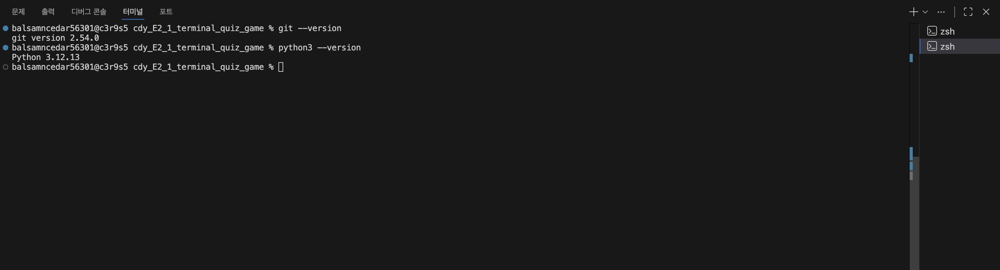
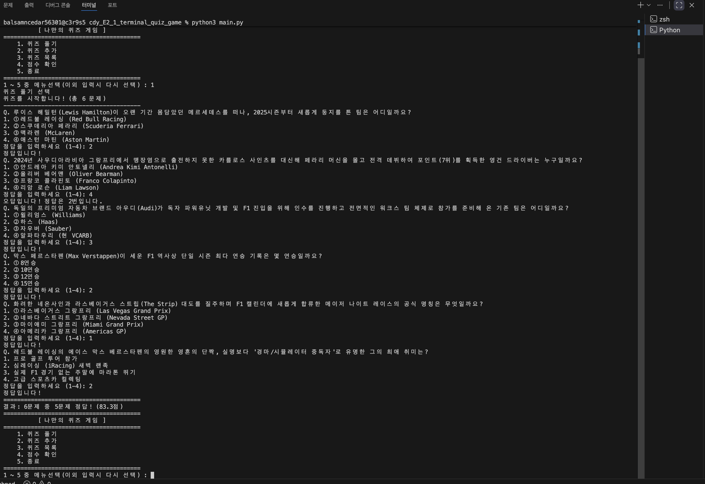
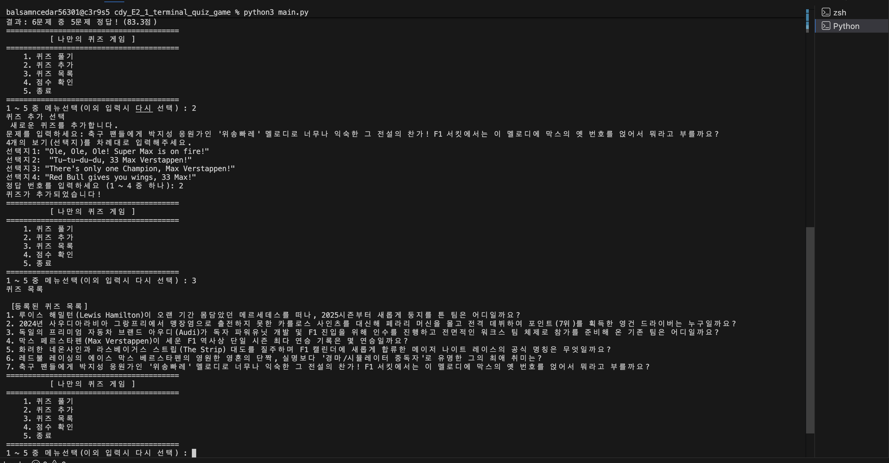
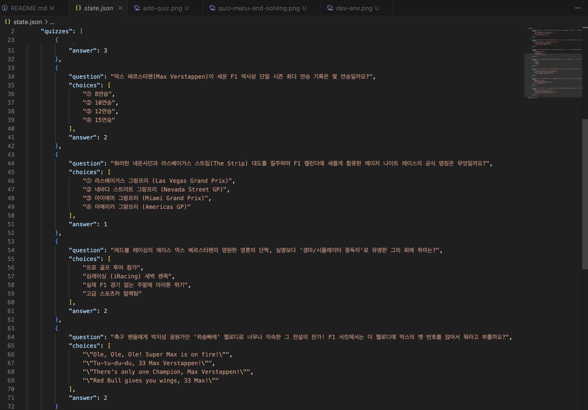
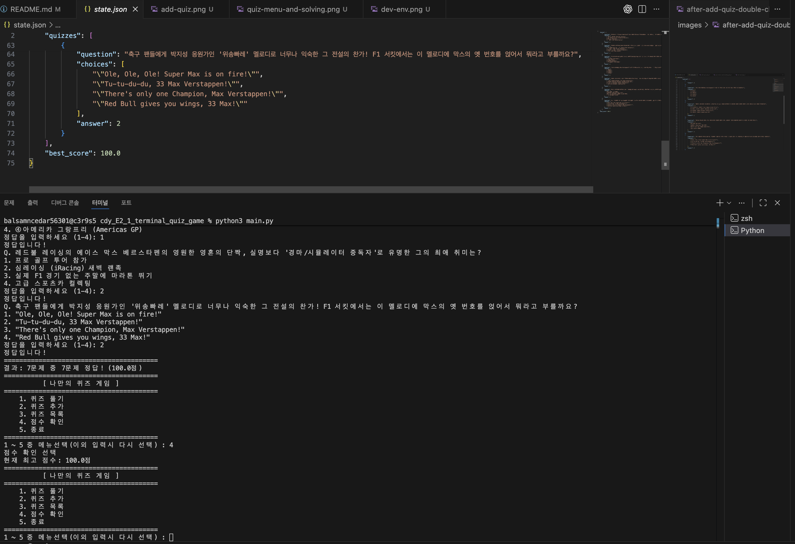
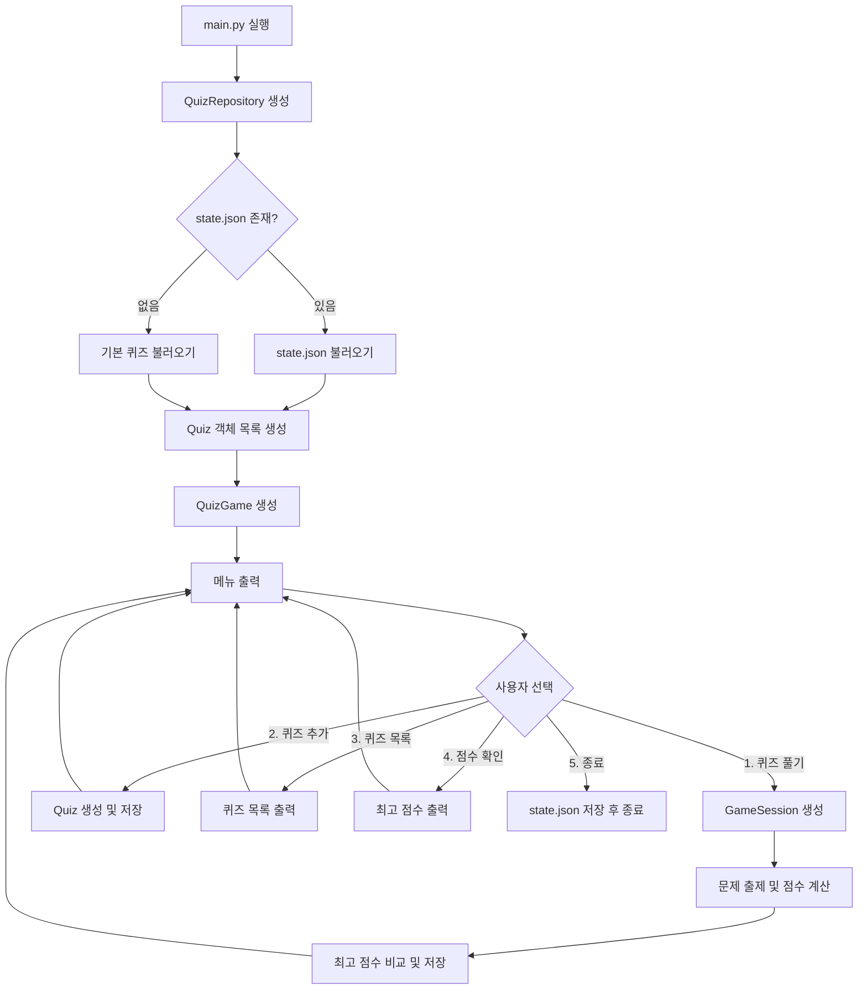
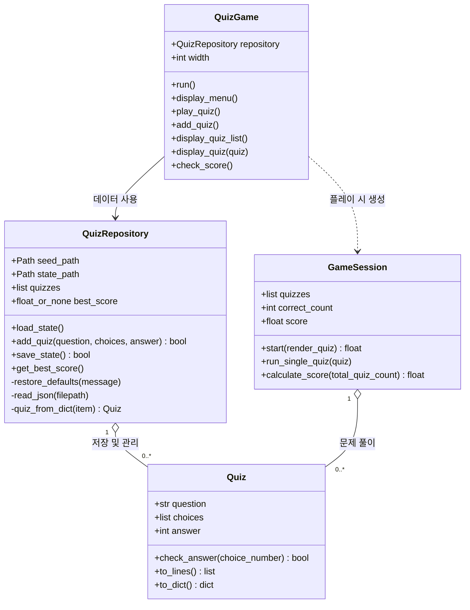
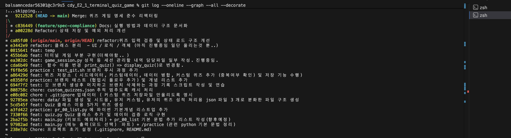

# F1 터미널 퀴즈 게임

## 프로젝트 개요

Python 3.10 이상에서 외부 라이브러리 없이 실행되는 4지선다 콘솔 퀴즈 게임입니다. 메뉴에서 퀴즈 풀기, 새 퀴즈 등록, 목록 조회, 최고 점수 확인을 할 수 있으며 사용자 데이터는 JSON 파일에 계속 보관됩니다.


## 퀴즈 주제와 선정 이유

주제는 Formula 1(F1)입니다. 드라이버, 팀, 그랑프리처럼 서로 연결된 소재가 풍부하고 정답이 명확하여 4지선다 퀴즈로 구성하기 좋다는 점에서 선택했습니다. 기본 F1 퀴즈 5개가 포함되어 있습니다.

## 실행 방법

필요 환경은 Python 3.10 이상입니다. 프로젝트 루트에서 다음 명령을 실행합니다.

* 개발 환경 설정 스크린샷 



```bash
python3 main.py
```

화면에 표시되는 1~5번 메뉴를 숫자로 선택합니다. 입력 앞뒤 공백은 자동으로 제거되며, 빈 입력·문자·범위를 벗어난 숫자는 안내 후 다시 입력받습니다. 실행 중 `Ctrl+C` 또는 입력 종료가 발생해도 가능한 데이터를 저장한 뒤 안전하게 종료합니다.

## 프로그램 실행 화면 (퀴즈 풀기 실행 및 메뉴)

- 퀴즈 메뉴 조회 퀴즈 풀기, 점수확인


- 퀴즈 추가 및 퀴즈 목록 조회



- 최고 점수 확인



## 테스트

```bash
python3 -m unittest discover -s tests -v
```

## 흐름도




## 기능 목록

- 저장된 모든 퀴즈 풀기 및 정답/오답 확인
- 전체 문제 수, 정답 수, 100점 만점 환산 결과 표시
- 최고 점수 비교, 갱신 및 영구 저장
- 문제, 선택지 4개, 정답 번호를 입력해 퀴즈 추가
- 등록된 퀴즈 목록 조회
- 잘못된 숫자 및 빈 입력 재입력 처리
- 데이터 파일 누락·손상·입출력 오류 처리
- 정상 종료, `Ctrl+C`, `EOFError` 발생 시 안전 종료

## 파일 구조

```text
.
├── main.py                  # 프로그램 시작점
├── quiz.py                  # 개별 문제를 표현하는 Quiz 클래스
├── quiz_game.py             # 메뉴와 전체 흐름을 담당하는 QuizGame 클래스
├── game_session.py          # 한 번의 풀이와 점수 계산
├── repository.py            # JSON 저장·불러오기와 복구
├── config.py                # 데이터 파일 경로
├── data/
│   └── seed_quizzes.json    # 첫 실행/복구용 기본 F1 퀴즈 5개
├── images/
│   └── git-log.png          # 깃 로그 이미지 
├── tests/                   # 자동 테스트
└── state.json               # 실행 시 생성되는 사용자 상태(커밋 제외)
```


## 프로젝트 구조 및 역할 분리

프로그램의 각 구성요소가 하나의 책임에 집중하도록 역할을 분리했습니다.
이를 통해 파일 처리, 게임 진행, 사용자 인터페이스가 서로 강하게 얽히지 않도록 구성했습니다.

| 구성요소             | 책임                    | 작성 의도                                        |
| ---------------- | --------------------- | -------------------------------------------- |
| `main.py`        | 객체 생성 및 프로그램 실행       | 프로그램의 진입점을 단순하게 유지하고, 필요한 객체를 생성·연결하는 역할만 담당 |
| `Quiz`           | 퀴즈 데이터 관리 및 유효성 검증    | 잘못된 질문, 선택지, 정답 데이터가 시스템 내부로 들어오는 것을 방지      |
| `QuizRepository` | JSON 데이터 로드·저장·복구     | 파일 입출력 책임을 게임 진행 로직과 분리하고, 데이터 저장 상태를 관리     |
| `GameSession`    | 한 번의 퀴즈 풀이 진행 및 점수 계산 | 한 게임 동안만 필요한 정답 수와 점수 등의 상태를 별도로 관리          |
| `QuizGame`       | 메뉴 출력 및 사용자 흐름 제어     | 사용자 입력과 메뉴 이동 등 전체 UI 흐름을 한곳에서 관리            |


### 구조 설계 의도

각 클래스가 서로 다른 책임을 가지도록 분리하여 코드의 역할을 명확하게 구성했습니다.

* `QuizRepository`는 **데이터를 어떻게 저장하고 불러올지**
* `GameSession`은 **한 번의 게임을 어떻게 진행할지**
* `QuizGame`은 **사용자에게 어떻게 보여주고 입력을 받을지**
* `Quiz`는 **퀴즈 하나가 어떤 데이터를 가져야 하는지**

를 각각 담당합니다.

이러한 구조를 통해 특정 기능을 수정하더라도 다른 영역에 미치는 영향을 줄이고, 이후 기능을 추가하거나 유지보수하기 쉽도록 설계했습니다.


## 클래스 구조도 

각 클래스는 퀴즈 데이터, 파일 저장, 한 번의 플레이, 전체 메뉴 진행을 각각 담당합니다.




## 데이터 파일 설명

프로젝트 루트의 `state.json` 한 파일에 UTF-8 JSON 형식으로 퀴즈와 최고 점수를 저장합니다. 파일이 없으면 `data/seed_quizzes.json`의 기본 퀴즈로 생성합니다. 파일이 손상되었거나 스키마가 잘못되면 안내 메시지를 표시하고 기본 데이터로 복구합니다.

```json
{
  "quizzes": [
    {
      "question": "문제 내용",
      "choices": ["선택지 1", "선택지 2", "선택지 3", "선택지 4"],
      "answer": 2
    }
  ],
  "best_score": null
}
```

`best_score`는 아직 플레이하지 않았을 때 `null`, 플레이 후에는 0~100 사이의 점수입니다. `state.json`은 사용자별 실행 데이터이므로 `.gitignore`에 포함됩니다.


## Git 실습 확인

과제 제출 전 다음 결과와 실행 화면을 캡처합니다.

```bash
python3 --version
git log --oneline --graph --all
```




또한 GitHub 저장소 URL, 개발 환경, 퀴즈 추가·목록·플레이·점수 화면을 제출 자료에 포함합니다. 개발 완료 후 별도 디렉터리에 저장소를 `clone`하고 README 한 줄을 수정해 commit/push한 다음, 원래 디렉터리에서 `pull`하여 반영을 확인합니다.


